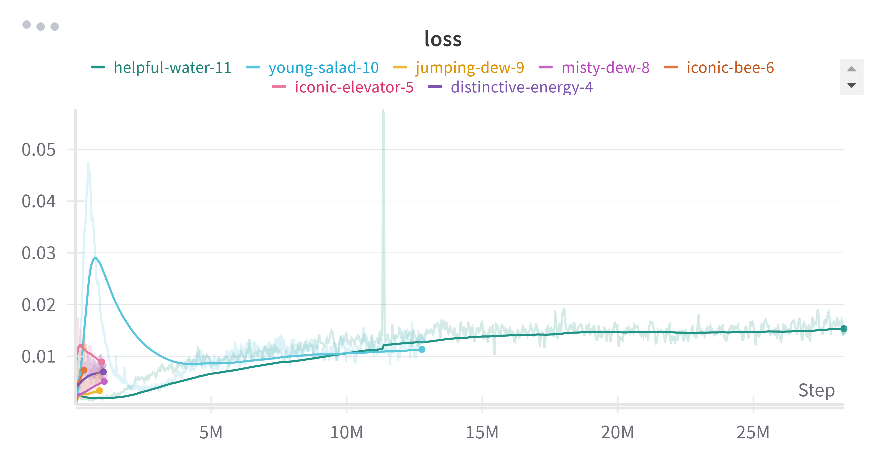

# Deep Q-Learning (DQN) Agent

This project implements a Deep Q-Learning (DQN) agent for playing Atari games using the Gymnasium library. It utilizes PyTorch for building and training the neural network model.

---

## Project Overview

This repository contains the following key components:
- **Agent Implementation**: `Agent_DQN` class that defines the agent’s behavior.
- **Model Definition**: Deep Q-Network (DQN) implemented in `dqn_model.py`.
- **Training Loop**: Training the agent to maximize rewards.
- **Experiment Results**: Performance metrics and insights from various experiments.

---

## Setup

1. Install Miniconda and create a virtual environment:
   ```bash
   conda create -n myenv python=3.11.4
   conda activate myenv
   ```

2. Install PyTorch:
   ```bash
   pip install torch torchvision torchaudio
   ```

3. Install required libraries:
   ```bash
   pip install -U "ray[rllib]" ipywidgets
   pip install opencv-python-headless gymnasium[atari] autorom[accept-rom-license]
   pip install tqdm moviepy ffmpeg scipy numpy
   ```

4. Run the project:
   ```bash
   python main.py
   ```

---

## Usage

- **Train the Agent**: To train the agent, simply run the `main.py` file. The agent will explore and learn through episodes, saving models at regular intervals.
- **Test the Agent**: Use `--test_dqn` flag to load a trained model and test its performance.

---

## PDF Report for Experiment Results

### Introduction

This section outlines the set of experiments performed to train and test the DQN model. Below is a detailed account of the experimental setup, parameters varied, and key findings.

---

### Experiment Setup  

**Network Structure**  
- Number of Layers: 3 layers (Input, Hidden, Output)  
- Number of Neurons per Layer:  
  - Input Layer: matches state space  
  - Hidden Layer: 128 neurons  
  - Output Layer: matches action space  

**Hyperparameters**  
- Batch Size: 32  
- Learning Rate: Varied between 0.000025 and 0.00025  
- Gamma (Discount Factor): Fixed at 0.99  
- Epsilon (Exploration Rate): Initial value 1.0, decayed over time  
- Epsilon Decay: Varied between 0.02 and 0.9995  
- Epsilon Min: Fixed at 0.01  
- Number of Episodes: Ranged from 10,000 to 100,000  

**Optimization Setup**  
- Loss Function: Mean Squared Error (MSE)  
- Optimizer: Adam Optimizer  

---

### Experiments Conducted  

1. **Baseline Experiment**  
   - Parameters: Default values for learning rate (0.00025), gamma (0.99), and batch size (32).  
   - Observation: Stabilization in reward trends post 20,000 episodes.

2. **Varying Epsilon Decay**  
   - Experiment: Tested decay rates of 0.02, 0.6225, and 0.9995.  
   - Outcome: Faster decay rates impacted exploration, reducing long-term performance. Best results at 0.995.

3. **Learning Rate Variations**  
   - Experiment: 0.000025, 0.000138, and 0.00025.  
   - Outcome: The higher learning rate improved convergence speed but increased fluctuations in loss.

4. **Extended Training**  
   - Experiment: Training extended up to 100,000 episodes.  
   - Observation: Marginal improvement in reward after 55,000 episodes.

---

### Results  

| Metric             | Minimum  | Maximum  | Mean     | Standard Deviation |
|--------------------|----------|----------|----------|---------------------|
| Average Reward      | 2.288    | 13.182   | 5.617    | 4.80                |
| Loss                | 0.002815 | 0.012295 | 0.0058   | 0.0034              |
| Total Reward        | 0.0      | 61.0     | 11.71    | 22.19               |
| Episodes            | 3,111    | 81,022   | 25,752   | 30,924              |

Screenshots
Below are visual representations of key metrics:

Average Rewards Over Episodes:


Total Rewards Over Episodes:


Loss Across Training:



---

### Conclusion  

The experimental results highlight the balance between exploration (epsilon decay) and learning rate optimization. These findings will inform further tuning to enhance performance in complex environments.
